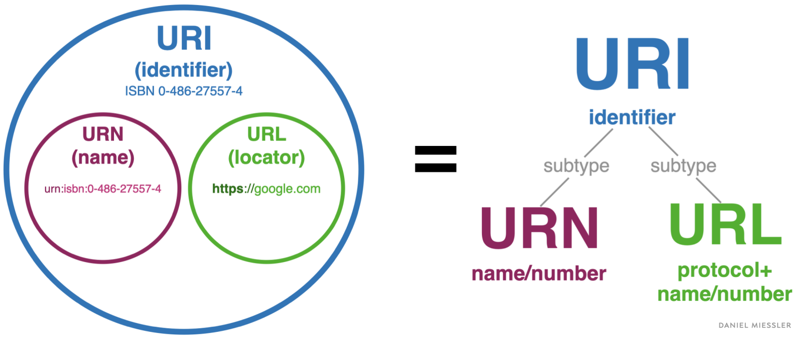
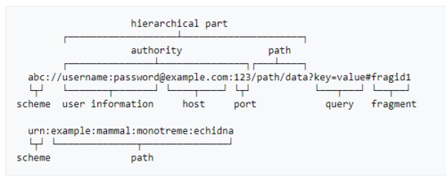

# URL과 리소스

## 2.1 인터넷의 리소스 탐색하기

URL(Uniform Resource Locator)은 인터넷의 리소스를 가리키는 표준이름이다.

URL은 전자정보 일부를 가리키고 그것이 어디에 있고 어떻게 접근할 수 있는지 알려준다.

URL은 브라우저가 정보를 찾는데 필요한 리소스의 위치를 가리킨다.

URL은 통합 자원 식별자(Uniform Resource Indentifier) 혹은 URI라고 불리는 더 일반화된 부류의 부분집합이다.

URN(Uniform Resource Name)은 현재 그 리소스가 어디에 존재하든 상관없이 그 이름만으로 리소스를 식별하는데 비해 URL은 리소스가 어디 있느지 설명해서 리소스를 식별한다.

이 셋의 관계를 그림으로 보면 아래와 같다.


[참조 및 이미지 - The Real Difference Between a URL and a URI](https://danielmiessler.com/study/difference-between-uri-url/)

다음과 같은 URL이 있다고 할때

`https://study.springboot.kr/docs/HTTP-완벽가이드/I.-HTTP-웹의-기초/02.URL과-리소스/`

URL의 첫 부분인 `https`는 URL의 스킴, URL 두번째 부분인 `study.springboot.kr`은 서버의 위치이고 URL의 세번째 부분인 `/docs/HTTP-완벽가이드/I.-HTTP-웹의-기초/02.URL과-리소스/`는 리소스의 경로다.

각 부분의 역할을 보면

- 스킴(scheme) - 웹 클라이언트가 리소스에 어떻게 접근하는지 알려준다. 
  - ex) https, ftp, rtsp
- 서버의 위치 - 웹 클라이언트가 리소스가 어디에 호스팅 되어 있는지 알려준다.
- 리소스의 경로 - 서버에 존재하는 로컬 리소스들 중에서 요청받은 리소스가 무엇인지 알려준다.

아래의 그림을 한번보고 넘어가길 바란다.


[참조 및 이미지 - What is a URL?](https://developer.mozilla.org/en-US/docs/Learn/Common_questions/What_is_a_URL)

## 2.2 URL 문법

URL의 문법을 쪼개면 일반적으로 9개의 부분으로 나뉘게 된다



[참조 및 이미지 - URLs and URIs](https://quizlet.com/255966740/5-urls-and-uris-flash-cards/)

- 스킴
- 사용자 이름
- 비밀번호
- 호스트
- 포트
- 경로
- 파라미터
- 질의
- 프래그먼트

## 2.3 단축 URL

상대 URL은 짧게 표기하는 방식이다.

상대 URL 문법에 따르면 HTML 작성자는 URL에 스킴과 호스트 그리고 다른 컴포넌트들을 입력하지 않아도 된다.

예로 현재 사이트에서 다음과 같은 코드를 사용 할 경우
```html

```
기저 URL을 사용해 기술하지 않은 정보를 추측할 수 있다.

기저 URL을 사용하게 되면 절대 URL은 `https://study.springboot.kr/hi.png` 가 된다.

## 2.4 안전하지 않은 문자

다음의 글로 대체 합니다.

[What is URL Encoding and How does it work?](https://www.urlencoder.io/learn/)

## 2.5 스킴의 바다

다음의 위키피디아 문서로 대체 합니다.

[List_of_URI_schemes](https://en.wikipedia.org/wiki/List_of_URI_schemes)


